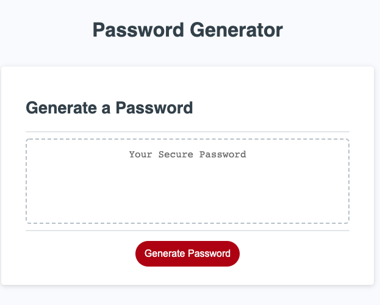
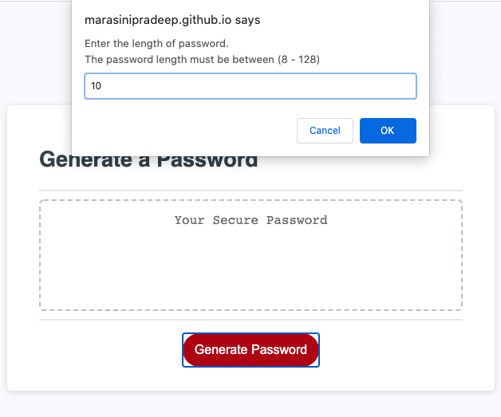
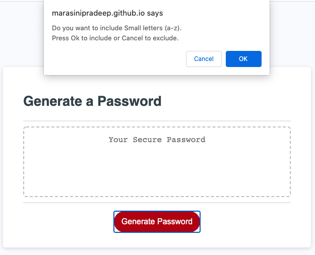
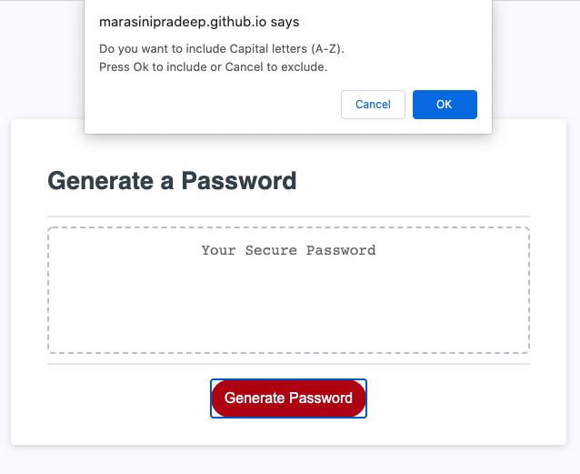
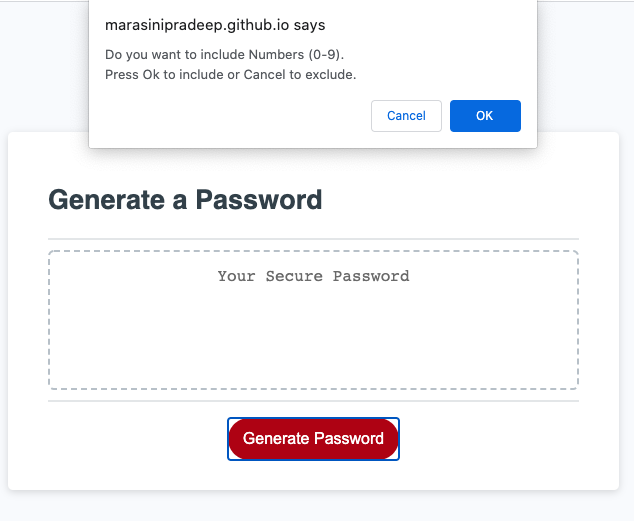
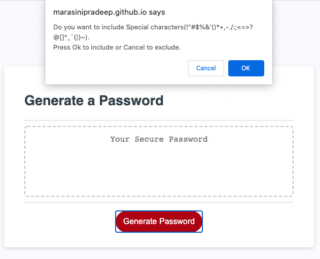
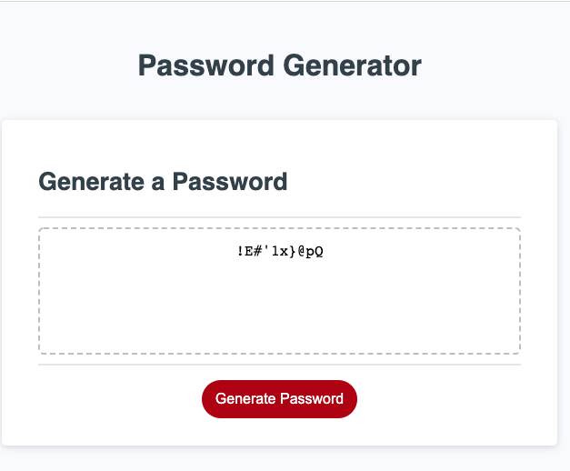

# random-password-generator
Strong and unique  password generator

## Basic Overview - [Live Demo](https://marasinipradeep.github.io/random-password-generator/.)

This is  an application that generates a random password, based on criteria selected by an user. This app mobile responsive, runs in the browser and has polished UI (user interface).

#### Features

 - Click Generate password button to generate a password.
 - Prompted for the length of the password at least 8 characters and no more than 128  characters.
 - If valid length is given then presented with a series of prompts for password criteria.
 - Prompted for character types to include in the password lowercase, uppercase, numeric, and/or special characters.
 - Select OK to include in the password or cancel to exclude in the password.
 - At least one character type should be selected otherwise there will be validation error message.
 - Password is generated at the end that matches the selected criteria.
 - Generated password is displayed on the page.

 ## Getting started

-First of all, Clone the project from github to local machine.
-Alternatively, you can download the .zip file and extract in suitable folder on local machine. 
-Open the file with suitable code editor (For examplle:-Visual Studio code, Sublime Text, Atom etc).
-You can view live demo clicking on link above.

## Screenshots of final outputs

# Default browser screen  

# Enter Length of Characters

# Prompt to include small Characters

# Prompt to include capital Characters

# Prompt to include numbers

# Prompt to include special Characters

# Output genereted pasword

